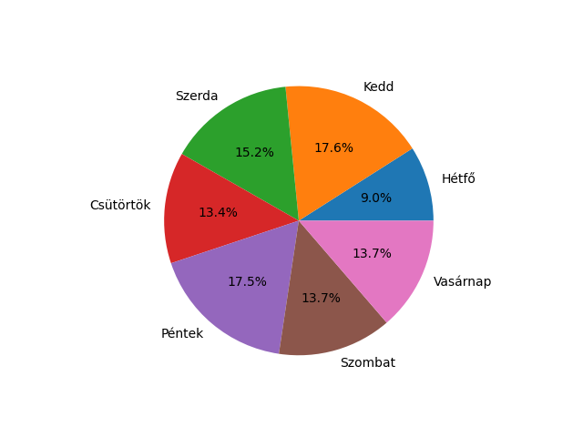
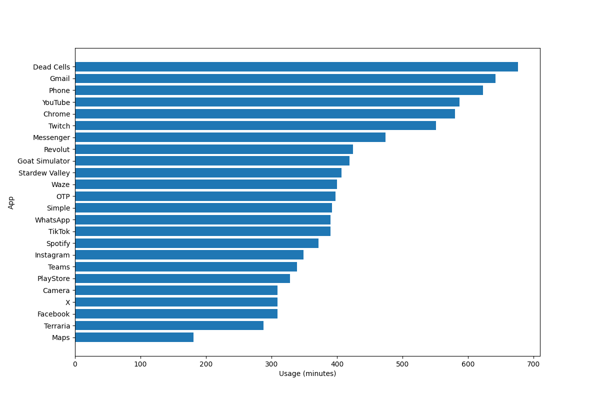
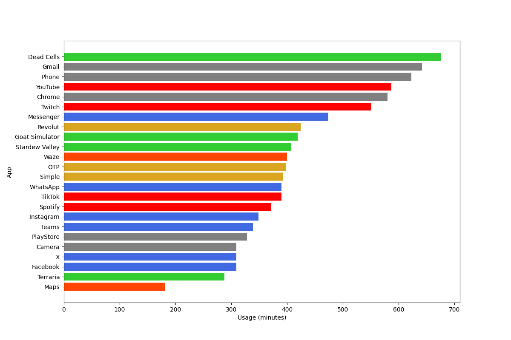
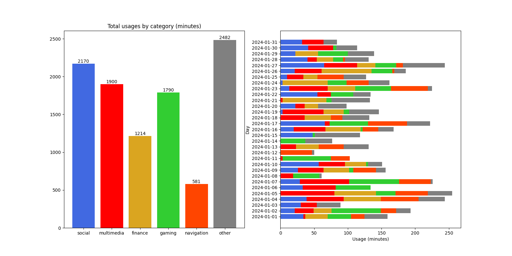

Egy okostelefon alkalmazás-használati statisztikáit bemutató Python programot kell készíteni.

A nyers adatok feldolgozását végző függvények implementációját a `database.py` tartalmazza, hogy most csak a diagramok készítésére kelljen koncentrálni, de gyakorlásként érdemes önállóan reprodukálni ezeket.

## Indítás

A program induláskor beolvassa az évszámot és a hónapot, majd beolvassa az adatokat a `yyyy-mm.json` fájlból.
*(A `database.read_usages` ezt elvégzi.)*

> A JSON fájlban egy tömb van a napi statisztikákkal.
> Minden naphoz adott a dátum (`"date": "yyyy-mm-dd"`), a hét napjának indexe (0-6, pl. kedd esetén `"weekday": 1`), és az egyes appokban töltött idő (`"usage"` objektum).
> Utóbbinak a kulcsai az appok nevei, az értékei pedig a használati idő percekben (pl.: `"TikTok": 39`).

## Statisztikai diagramok

A program készítsen diagramokat, amiket exportáljon PNG formátumban.

A diagramok stílusa kövesse az itt látható példa ábrák megjelenését!

### 1: Napi átlagok

Készüljön egy tortadiagram, ami a használati időknek a hét napjaira való százalékos megoszlását mutatják.
Mivel a hónapban nem biztos, hogy ugyanannyiszor fordulnak elő a hét napjai, az ebből eredő torzítás kiküszöböléséhez a használati idők összegeit le kell osztani a napok előfordulásainak számával.

Példa:

### 2: Összesítés appok szerint

Készüljön egy sávdiagram, ami az egyes appok összesített használati idejeit mutatja.
Az appok legyenek használati idő szerint fentről lefelé csökkenő sorrendben.

Példa:

### 3: Színezés kategóriák szerint

Az alkalmazások kategorizálva vannak az `apps.json` fájlban: a kulcsok a kategóriák nevei, az értékek a kategóriába tartozó appok neveinek listái.
Minden app pontosan egy kategóriába tartozik.

Az előző diagram sávjait színezze ki az appok kategóriái szerint.
A kategóriákhoz tartozó színeket a `category_colors.json` adja meg.

Példa:

### 4: Összesítés kategóriák szerint

Készüljön egy oszlopdiagram, ami a kategóriák szerinti összesített használati időket ábrázolja.

Szorgalmi feladat: egy halmozott sávdiagram minden napra mutassa be a kategóriánkénti megoszlást.
*Segítségül [itt egy példa](https://matplotlib.org/stable/gallery/lines_bars_and_markers/bar_stacked.html) halmozott oszlopdiagram készítésére. A `bottom` helyett `barh` esetén `left` kell.*

Példa:

