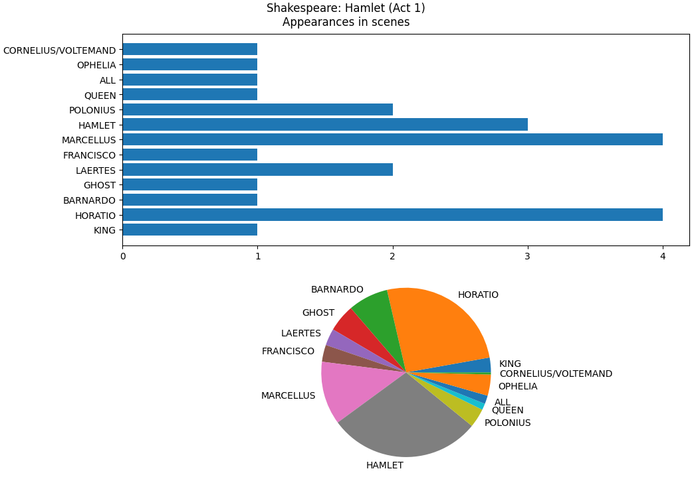

[](https://classroom.github.com/a/TryNzvEa)
A feladat egy olyan program elkészítése, amely színdarabok szövegkönyveiről készít statisztikákat.

A program a [main.py](main.py) futtatásával legyen indítható.

Parancssori argumentumként opcionálisan megadható egy könyvtár elérési útja, ahol a színdarab szövegei találhatók.
Ha ez megadásra került, akkor induláskor kerüljön beolvasásra.
Ha a könyvtár nem található, vagy nem lett megadva argumentum, kérjen be egy elérési utat a felhasználótól.
Ezt addig ismételje, míg egy létező könyvtárt nem kap.

A beolvasáshoz használja a [play.py](play.py)-ban található `load_play` függvényt, ami a könyvtárban lévő `.txt` fájlokra hívja meg a [scene.py](scene.py)-ban található `load_scene` függvényt.

A függvényeket type hintekkel kell ellátni, hogy a `mypy` a megadott beállításokkal (`mypy.ini`) ne jelezzen hibát!

Minden jelenet (scene) szövegkönyve egy külön `jelenet_neve.txt` fájlban van tárolva.
A jelenetben a karakterek megszólalásai (speeches) vannak.
**Minden megszólalás első sora a megszólaló karakter nevét tartalmazza csupa nagybetűvel.**
Az ezt követő sorokban van a megszólalás szövege, amit egy üres sor zár le.
Ezután lehetnek szögletes zárójelbe írt rendezői utasítások, a következő megszólalást ismét a karakter nagybetűs nevét tartalmazó sor előzi meg.

A `load_scene` olvassa be a jelenet szövegkönyvét, és adja vissza a megszólaló karakterek listáját.
Minden karakter neve annyiszor szerepeljen a listában, ahányszor megszólal a jelenetben.

A főmenü 1. menüpontjában lehessen új színdarabot beolvasni.
Itt hiba esetén térjen vissza a főmenübe, és maradjon változatlan a korábban beolvasott színdarab.

A 2. és 3. menüpontokhoz készüljenek segédfüggvények a megfelelő modulokban, és az alábbi módon működjenek:

A 2. menüpont kiválasztásakor kérje be egy karakter nevét (kis- és nagybetűket NE vegye figyelembe), majd listázza ki azon jelenetek nevét, amelyekben a karakter legalább egyszer megszólal.
Ha a karakter nem található a színdarabban, írja ki az `Error: No character with this name.` hibaüzenetet, és térjen vissza a főmenübe.

A 3. menüpont kiválasztásakor készítsen egy kimutatást:

- Jelenítsen meg 2 diagramot egymás alatt:
  - A diagram címében jelenjen meg a színdarab szerzője és címe
  - Egy vízszintes oszlopdiagram ábrázolja, hogy melyik szereplő hány jelenetben szerepel.
  - Egy kördiagram mutassa be, hogy a szereplők megszólalásainak számai (a teljes színdarabban) hogyan aránylanak egymáshoz.
    - Ezek a számok jelenjenek meg a parancsor kimenetén is!

Példa kimenetek a `hamlet-demo`-ra:

```
Currently opened play: hamlet-demo
Total number of speeches: 251

Main menu:
1: Open a play from a directory
2: List scenes of a character
3: Display number of speeches by characters
0: Exit
Select a menu option: 2
Enter character name: queen
act-1-scene-2
```

```
Currently opened play: hamlet-demo
Total number of speeches: 251

Main menu:
1: Open a play from a directory
2: List scenes of a character
3: Display number of speeches by characters
0: Exit
Select a menu option: 2
Enter character name: horatio
act-1-scene-1
act-1-scene-2
act-1-scene-4
act-1-scene-5
```

```
Currently opened play: hamlet-demo
Total number of speeches: 251

Main menu:
1: Open a play from a directory
2: List scenes of a character
3: Display number of speeches by characters
0: Exit
Select a menu option: 2
Enter character name: romeo
Error: No character with this name.
```

```
Currently opened play: hamlet-demo
Total number of speeches: 251

Main menu:
1: Open a play from a directory
2: List scenes of a character
3: Display number of speeches by characters
0: Exit
Select a menu option: 3
BARNARDO: 19
FRANCISCO: 8
HORATIO: 64
KING: 7
CORNELIUS/VOLTEMAND: 1
QUEEN: 3
OPHELIA: 10
LAERTES: 8
BARNARDO/MARCELLUS: 1
GHOST: 13
HORATIO/MARCELLUS: 2
POLONIUS: 9
ALL: 4
HAMLET: 72
MARCELLUS: 30
```


